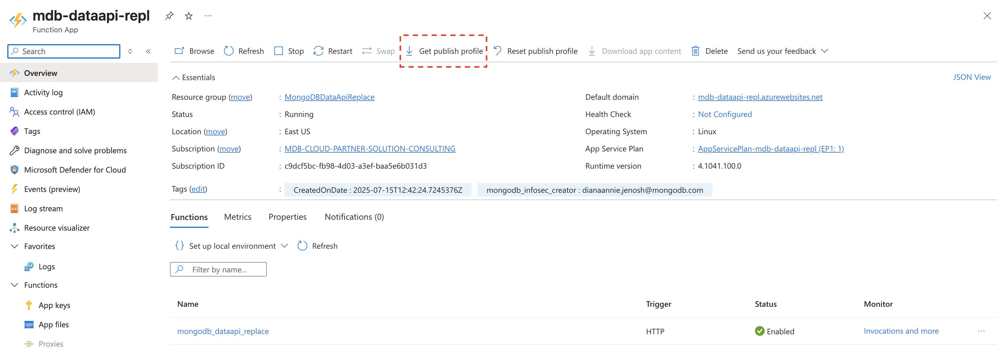
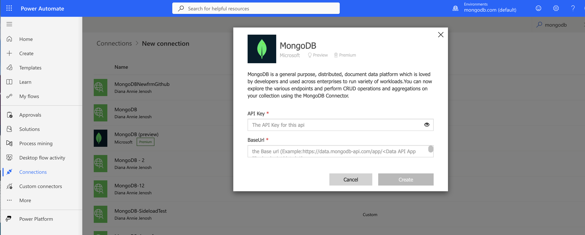

MongoDB Connector provides a simple way to connect to MongoDB Atlas via Data APIs hosted using Azure function in your tenant to read and write data to MongoDB Atlas collections. MongoDB connector makes it easy to perform CRUD operations and aggregations on your data in minutes and allows you to query MongoDB to build rich apps and workflows in Power Apps, Power Automate and Logic Apps. 
**Please note that MongoDB deprecated the Atlas Data APIs from September, 2025 and thus please use this connector mechnaism to set up an Azure function and use its url and API keys instead of Atlas' ones in your Apps and Flows.**

## Prerequisites

1. **Configure Atlas Environment**

Register for a new Atlas Account [here](https://www.mongodb.com/docs/atlas/tutorial/create-atlas-account/#register-a-new-service-account). Follow steps from 1 to 4 (Create an Atlas account, Deploy a Free cluster, Add your IP to the IP access list and Create a Database user) to set up the Atlas environment.

2. **Set Up Azure Function as Atlas Data API**
    To set up the Azure function which will host the code to act as Atlas Data APIs, we have two options - 1. Using GitHub Actions OR 2. Using Zip Deploy

    Choose the GitHub actions method, if you are able to fork the current repo, have GitHub actions enabled in that repo and that you would want to add more APIs and prefer a CI/CD or DevOps way set up ot of the box.
    If you are looking for a quick and easy way of deployment and just need the Azure function set up and substitute the Data APIs.

    **Option 1: Set Up Azure function Using GitHub actions**
   
   a.Fork the [MongoDB repo](https://github.com/mongodb-partners/MongoDB_DataAPI_Azure). Note the new **forked repo url**.

   b.Click the below **Deploy to Azure** button to have the Azure function created in your tenant.

   

   c. Select or Create your Resource group which will contain the Azure function and its associated components (App Service Plan, Storage Account and App Insights). You can keep the function name and SKU as the defaults or change if you like to follow some specific standards.
   Give the MongoDB connection url for the Cluster against which this Azure function will run. This connection string will be saved as an Environmnet variable.
   Give your forked repo url as GitHub repo. Select *Create* and it will create the Azure function with the associated resources.
        
   d.  To have GitHub actions run from your repo, get the publishing profile from your created Azure function
        
   

   e.   Go to your GitHub repo -> Settings -> Secrets and variables -> Actions
             Click **New Respository secret** and copy the entire value in your publishing profile to a new secret named "AZUREAPPSERVICE_PUBLISHPROFILE"
   
   f.  Make a minor change in README and **Commit Changes** to invoke GitHub actions whcih would deploy the python code to the Azure function
             Now you should see the function available in the Functon App and the code in function_app.py deployed.
   
   g. GitHub actions tab in GitHub repo will show the steps in the deployment (including the installation of dependencies) and the result of each step.

    **Option 2: Set Up Azure function Using ZipDeploy**
   
   a.  Click the below **Deploy to Azure** button to have the Azure function created in your tenant.

   

   b. Select or Create your Resource group which will contain the Azure function and its associated components (App Service Plan, Storage Account and App Insights). You can keep the function name and SKU as the defaults or change if you like to follow some specific standards. Please ** DONOT change ** the packageUrl as its the SAS url of the Storage account which has the zip taht needs to be deployed. Select *Create* and it will create the Azure function app, deploy the azure function along with the associated resources.

## How to get credentials

**Get the BaseUrl and API Key**
    i. From the Function App, select your function and click **Get function URL** . Copy the function url from beginning till before "/action" as shown in screenshot below. This is the **Base Url** you will use to invoke any of the MongoDB CRUD/ Aggregate APIs.
    
    ii. Go to your Function App -> Under Functions -> App keys , Grab either the *_master* or *default* API key for your Azure function
    This is the **API Key** you will use along with **Base Url** to create a MongoDB connection to invoke any of the MongoDB CRUD/ Aggregate APIs.

## Get started with your connector

1. Once the Prerequisites are completed, Go to PowerAutomate -> Connections. Click on "New Connection" and search for MongoDB in the Search Bar on the top right, as shown below in the screenshot.

2. Click on the MongoDB connection and you would see the below popup which asks to enter the API key and the Base URL.

3. For the "Base Url" and the "API Key" fields, enter the values retrieved from  [How to get credentials](#how-to-get-credentials) section above

Use one of the 8 Data APIs for any CRUD operations against your MongoDB Atlas Cluster. For complex queries, use the "Run an Aggregation Pipeline" API to use aggregation stages to massage the output from one stage to another. The flexibility and dynamism of MongoDB allows you to create rich apps and automate any time consuming processes. You keep enhancing the apps by adding more features and fields to the same collection.

## Known issues and limitations

As MongoDB does not enforce a schema, the current connector can be used with Power Automate and Logic Apps only, which supports dynamic schema for the API response, which can then be parsed using the "Parse JSON" constructs. It can be used in Power Apps by invoking a Power Automate flow for every MongoDB interaction. You can also continue to use the certified MongoDB connector from the [Microsoft Github repository](https://github.com/microsoft/PowerPlatformConnectors/tree/dev/certified-connectors/MongoDB) as a Custom connector to use it in Power Apps directly to customize the Response schema as per your MongoDB collection schema.

Restrictions applicable to MongoDB Data API does apply to the MongoDB connector also. Please refer to this [link](https://www.mongodb.com/docs/atlas/app-services/mongodb/crud-and-aggregation-apis/#aggregation-pipeline-stage-availability) to know more about the aggregation stages that are not supported under User context of Data APIs.

Please follow this [link](https://learn.microsoft.com/en-us/azure/azure-functions/functions-scale) for the known limitations with the Azure functions like time outs and other service limits for each resource plans.

## Common errors and remedies

Typical API response codes apply here also. Any 4XX errors indicate issue with the request from the client. Make sure that the dataSource, database, collection are provided in a valid JSON format. Refer to this [Postman Collection](https://grey-desert-5714.postman.co/workspace/My-Workspace~4b24f70a-aab6-4eb2-8bea-362ddc3a10c0/collection/5631262-a038ba24-f185-4671-acf2-530b3a3ddb55?action=share&source=copy-link&creator=5631262) for examples. For 5XX errors, make sure the Azure function is up and running and check its trace to further investigate.
